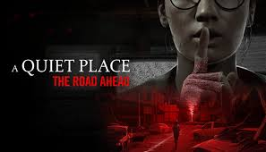

+++
date = '2024-11-08T21:13:42+01:00'
draft = true
title = 'A Quiet Place the Road Ahead'
categories = ['Jeu']
+++

# Résumé du jeu: A Quiet Place The Road Ahead

## Histoire

Ce jeu se déroule dans l'univers de A Quiet Place, le film de 2018 (ainsi que de ses deux suites). L'histoire se déroule dans un monde post-apocalyptique où des créatures monstrueuses ont envahi la Terre. Les créatures sont sensibles au son et sont attirées par les humains qui font du bruit. 
Dans le jeu, nous incarnons Alex qui pendant son périple pour échapper aux créatures.

## Gameplay

Pour ce qui est du gameplay, le jeu tourne bien entendu sur la gestion de bruit et la gestion de la respiration de notre personnage. Le jeu est une suite de niveau avec des environnements différents dans lesquels il faut naviguer en évitant de faire du bruit. Le jeu nous force ainsi à faire attention à notre environnement et à la façon dont nous nous déplacons. Par exemple marcher dans une flaque d'eau peut créer un bruit qui attira les créatures ou au contraire se déplacer accroupi permet de faire moins de bruit.

## Avis

Le jeu est relativement facile, il n'y a pas de difficultés majeures à surmonter. Le jeu ne propose pas un gameplay très varié, il n'y a pas de combat ou autre activités mais le jeu étant assez court, environ 8h, cela ne représente pas un inconvénient majeur.
Toutefois ce n'est pas le jeu de l'année, il me parait préfèrable d'attendre les soldes pour y jouer.
